# Тестовый отчет - Команда BogoSort

## 1. Общая информация
**Проект:** Эмпориум  
**Команда:** BogoSort  
**Состав команды:**
- Агеева Ксения
- Чупраков Сергей
- Санин Фёдор
- Куренков Дмитрий

**Ментор:**
- Денис

**Дата начала тестирования:** 25 февраля 2025  
**Дата завершения тестирования:** 12 марта 2025

## 2. Описание тестирования
**Цель тестирования:** Проверка функциональности и нефункциональных характеристик проекта Эмпориум.

> ***Комментарий:***  
> Позитивные и негативные кейсы

> [!IMPORTANT]  
> Проверка производится в браузере Google Chrome, если не написано иное напрямую

> [!IMPORTANT]  
> Под "битыми символами" в условиях этого тестирования подразумеваются символы в стиле **zalgo**, которые выглядят искажёнными или нечитаемыми из-за добавления специальных символов, создающих визуальные искажения текста.

## 3. Структура отчета
4. [Тестирование](#тестирование)
5. [Баги](#баги)
6. [Выводы](#выводы)

---

## 4. Тестирование <a name="тестирование"></a>

### 4.1 Отчет о тестировании страницы создания и редактирования объявления

#### 4.1.1 Страница создания объявления

##### 4.1.1.1 Доступ к странице
- **Переход через хедер (для авториозванного пользователя):**
  - Клик на кнопку "Добавить объявление" в хедере ведет на страницу создания объявления.
  - **Результат:** Переход работает корректно.

##### 4.1.1.2 Форма создания объявления
- **Поля формы:**
  - Категория (выпадающий список)
  - Название товара (текстовое поле)
  - Цена (числовое поле)
  - Описание (текстовое поле)
  - Фотография (загрузка файла)
  - Адрес (текстовое поле)
- **Кнопка "Разместить объявление":**
  - Отправляет форму и создает объявление.

##### 4.1.1.3 Взаимодействия с компонентами
###### Общее
- **Успешное добавление товара:**
  - **Ввод:**
    - Категория: _Спорт и отдых_
    - Название товара: _Jogel Мяч баскетбольный JB-100_
    - Цена: _999_
    - Описание:  
      ```
      Топовый мяч, хорошо отскакивает от большинства поверхностей. Хорошо подходит для стритбола и как для начала занятий баскетболом, так и для профессиональной деятельности.
      ```
    - Фотография: _Файл изображения_
    - Адрес: _Москва, ул. Тверская, 12_
  - **Действие:** Нажатие на кнопку "Разместить объявление".
  - **Ожидание:** Объявление создано и отображается в каталоге, фотография загружена корректно.
  - **Результат:**  
    - Объявление создано и отображается в каталоге.
###### Название
- **Эмодзи в названии:**
  - **Ввод:** `🙂`.
  - **Ожидание:** Система принимает эмодзи.
  - **Результат:** Объявление создано с эмодзи в названии.
- **Название не заполнено:**
  - **Ввод:** Пустое поле "Название".
  - **Ожидание:** Подсветка поля и сообщение об ошибке.
  - **Результат:** Поле "Название" выделяется красным.
###### Цена
- **Цена равная 0:**
  - **Ввод:** Цена = `0`.
  - **Действие:** Нажатие на кнопку "Разместить объявление".
  - **Ожидание:** Система принимает объявление с нулевой ценой.
  - **Результат:** Объявление создано успешно.
- **Отрицательная цена:**
  - **Ввод:** `-2`.
  - **Ожидание:** Подсветка поля и сообщение об ошибке.
  - **Результат:** Поле "Цена" выделяется красным.
- **Дробные числа в цене:**
  - **Ввод:** `0.55555`.
  - **Ожидание:** Сообщение об ошибке.
  - **Результат:** Выводится уведомление о невозможности дробной цены.
- **Пустое поле "Цена":**
  - **Ввод:** Пустое поле.
  - **Ожидание:** Подсветка поля и сообщение об ошибке.
  - **Результат:** Поле "Цена" выделяется красным.
###### Описание
- **Пустое поле "Описание":**
  - **Ввод:** Пустое поле.
  - **Ожидание:** Подсветка поля и сообщение об ошибке.
  - **Результат:** Поле "Описание" выделяется красным.
- **Длинное описание:**
  - **Ввод:** Текст более 3000 символов.
  - **Ожидание:** Ограничение ввода до 3000 символов.
  - **Результат:** Ввод ограничен 3000 символов.
###### Адрес
- **Пустое поле "Адрес":**
  - **Ввод:** Пустое поле.
  - **Ожидание:** Подсветка поля и сообщение об ошибке.
  - **Результат:** Поле "Адрес" выделяется красным.
- **Длинный адрес:**
  - **Ввод:** Текст более 150 символов.
  - **Ожидание:** Ограничение ввода до 150 символов.
  - **Результат:** Ввод ограничен 150 символами.
- **Адрес содержит код:**
  - **Ввод:** `<script>alert("Hello")</script>`.
  - **Ожидание:** Код не выполняется, отображается как текст.
  - **Результат:** Объявление создано, код отображается как текст без выполнения.

##### 4.1.1.5 Визуальные тесты в других браузерах
- **Safari, Firefox, Opera, Microsoft Edge, Yandex:**
  - **Ожидание:** Визуальная и функциональная составляющая идентичны Google Chrome.
  - **Результат:** Все браузеры показали одинаковую визуальную и функциональную работу.

#### 4.1.2 Страница редактирования объявления

##### 4.1.2.1 Доступ к странице
- **Переход из страницы созданного объявления:**
  - На странице объявления (доступной через каталог) есть кнопка "Редактировать", ведущая на страницу редактирования.
  - **Результат:** Переход работает корректно.

##### 4.1.2.2 Форма редактирования объявления
- **Поля формы:** Аналогичны форме создания объявления.
- **Кнопка "Сохранить изменения":** Сохраняет изменения в объявлении.

##### 4.1.2.3 Общее взаимодействие со страницей
- **Успешное редактирование товара:**
  - **Ввод:** Изменение данных в любом из полей (например, цена с `999` на `1499`).
  - **Действие:** Нажатие на кнопку "Сохранить изменения".
  - **Ожидание:** Изменения сохранены, обновленное объявление отображается в каталоге.
  - **Результат:** Изменения сохранены корректно.

##### 4.1.2.4 Проверка функциональности
- **Аналогичны сценариям для создания объявления:**
  - Пустые поля, некорректные данные (отрицательная цена, дробные числа, длинный текст и т.д.).
  - **Ожидание:** Логика поведения полей формы совпадает со страницей создания объявления.
  - **Результат:** Поведение идентично странице создания.

<br/><br/><br/>

### 4.3 Страница своего товара

##### Визуальные

###### Описание

**$${\color{gold}БАГ.}$$**

- [ ] **Уменьшение экрана до ширины 300px** <a name="bug-4.3-001"></a>
  - **Фактический результат:** Выход за границы экрана

  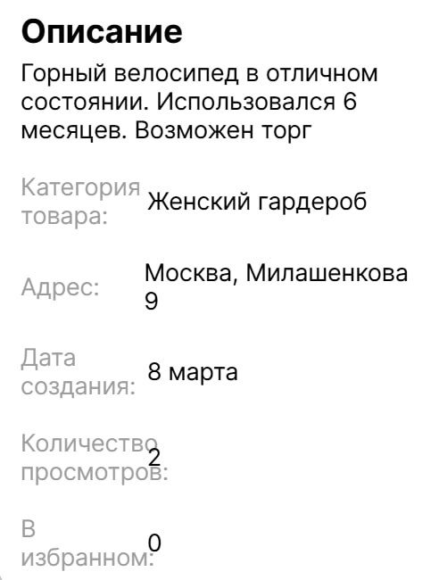

#### Оплата

**$${\color{gold}БАГ.}$$**

- [ ] **Уменьшение экрана до ширины 300px** <a name="bug-4.3-002"></a>
  - **Фактический результат:** Выход за границы экрана

  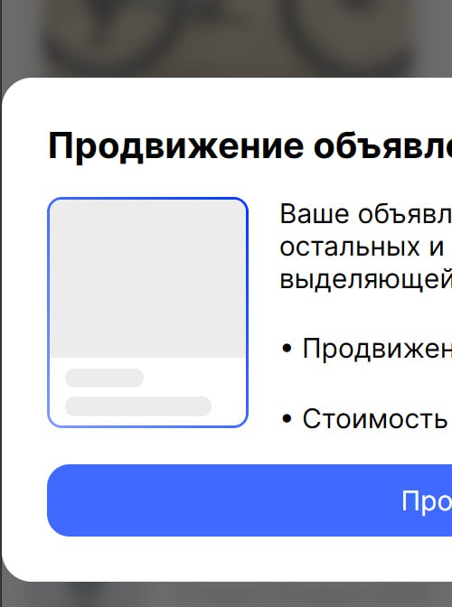

<br/><br/><br/>

### 4.4 Отчет о тестировании функциональности поиска

#### 4.4.1 Доступ к поиску
- **Местоположение:**
  - Поиск является составляющей частью хедера и доступен на всех страницах сайта.
  - **Результат:** Переход к поиску возможен с любой страницы через хедер.

#### 4.4.2 Форма поиска
- **Компоненты поиска:**
  - Поле ввода для поискового запроса.
  - Кнопка "Найти".
  - **Результат:** Оба компонента присутствуют и отображаются корректно.

#### 4.4.3 Функциональность поиска
- **Пустой поисковый запрос:**
  - **Ввод:** Пустое поле поиска.
  - **Действие:** Нажатие на кнопку "Найти".
  - **Ожидание:** Кнопка "Найти" не работает, пользователь остается на той же странице.
  - **Результат:** Кнопка "Найти" не реагирует, страница не изменяется.
- **Успешный поиск по полному названию товара:**
  - **Ввод:** `Настольная игра`.
  - **Действие:** Нажатие на кнопку "Найти".
  - **Ожидание:** Отображение товаров с названием "Настольная игра" в результатах поиска.
  - **Результат:** Искомые товары отображаются корректно.
- **Успешный поиск по неполному названию товара:**
  - **Ввод:** `Настольная игр`.
  - **Действие:** Нажатие на кнопку "Найти".
  - **Ожидание:** Отображение товаров, содержащих "Настольная игр" (например, "Настольная игра").
  - **Результат:** Искомые товары отображаются в результатах поиска.
- **Поиск с учетом регистра:**
  - **Ввод:** `настольная игра` (в нижнем регистре).
  - **Действие:** Нажатие на кнопку "Найти".
  - **Ожидание:** Поиск не чувствителен к регистру, отображаются товары с названием "Настольная игра".
  - **Результат:** Искомые товары отображаются независимо от регистра.

##### 4.4.4 Тесты в других браузерах
- **Safari:**
  - **Ожидание:** Визуальная и функциональная составляющая идентичны Google Chrome.
  - **Результат:** Визуальная и функциональная составляющая остались прежними.
- **Firefox:**
  - **Ожидание:** Функциональная составляющая идентична Google Chrome.
  - **Результат:** Функциональная составляющая осталась прежней.
- **Opera:**
  - **Ожидание:** Визуальная и функциональная составляющая идентичны Google Chrome.
  - **Результат:** Визуальная и функциональная составляющая остались прежними.
- **Microsoft Edge:**
  - **Ожидание:** Визуальная и функциональная составляющая идентичны Google Chrome.
  - **Результат:** Визуальная и функциональная составляющая остались прежними.
- **Yandex:**
  - **Ожидание:** Визуальная и функциональная составляющая идентичны Google Chrome.
  - **Результат:** Визуальная и функциональная составляющая остались прежними.

<br/><br/><br/>

### 4.5 Оформление заказа

##### Позитивные сценарии

- [x] **Успешное оформление заказа**
  - **Ввод:**
    - Вид доставки: _Доставка_
    - ФИО получателя: _Иванов Иван Иванович_
    - Адрес доставки: _г.Москва, ул.Пушкина, д.15 к.1_
  - **Действие:** Нажатие на кнопку "Оформить заказ"

    

  - **Ожидание:**
    - Заказ успешно оформлен
    - Произошел редирект на страницу с заказами

      

  - **Фактический результат:**
    - [x] Заказ успешно оформлен
    - [x] Произошел редирект на страницу с заказами

##### Негативные сценарии

###### Вид доставки

**$${\color{gold}БАГ.}$$**

- [ ]  **Изменить в html значение value на несуществующее** <a name="bug-4.5-001"></a>
  - **Ввод:** Вид доставки `Доставка` // Перед этим поменять значение value c `delivery` на `delivery111`

  

    - **Ожидание:** Не пропустит, вернет ошибку
    - **Фактический результат:** Не пропустило, вернуло ошибку, но с бекенда

      

###### ФИО получателя

- [x] **Поле не заполнено**
  - **Ввод:** пустое поле
  - **Ожидание:** Подсветить поле ввода: "ФИО получателя"
  - **Фактический результат:** Появилась подсказка `Заполните это поле.` для поля "ФИО получателя".

    

- [x] **Убрать в html аттрибут required для поля**
  - **Ввод:** пустое поле // Перед этим убрать аттрибут `required`

    

  - **Ожидание:** Подсветить поле ввода "ФИО получателя"
  - **Фактический результат:** Подсветилось красным поле "ФИО получателя".

    

**$${\color{gold}БАГ.}$$**

- [ ] **Ввод слишком длинный (250 символов)** <a name="bug-4.5-002"></a>
  - **Ввод:**
  ```md
  оооооооооооооооооооооооооооооооооооооооооооооооооооооооооооооооооооооооооооооооооооооооооооооооооооооооооооооооооооооооооооооооооооооооооооооооооооооооооооооооооооооооооооооооооооооооооооооооооооооооооооооооооооооооооооооооооооооооооооооооооооооооооо
  ```
  - **Ожидание:** Ошибка "Длина ФИО не должна превышать N символов"
  - **Фактический результат:** Вернулась ошибка с бэкенда

    

**$${\color{gold}БАГ.}$$**

- [ ] **Введены битые символы** <a name="bug-4.5-003"></a>
  - **Ввод:** `Hello` // обработанное через https://zalgo.org/

    

  - **Ожидание:** Вывод соответствующего уведомления о невозможности использования подобных символов
  - **Фактический результат:** Заказ успешно создался

    

- [x] **Эмодзи в поле ввода**
  - **Ввод:** `🙂`

    

  - **Ожидание:** Создание заказа с таким ФИО
  - **Фактический результат:** Создание заказа с таким ФИО

    

###### Адрес доставки

- [x] **Поле не заполнено**
  - **Ввод:** пустое поле
  - **Ожидание:** Подсветить поле ввода: "Адрес доставки"
  - **Фактический результат:** Появилась подсказка `Заполните это поле.` для поля "Адрес доставки".

    

- [x] **Убрать в html аттрибут required для поля**
  - **Ввод:** пустое поле // Перед этим убрать аттрибут `required`

    

  - **Ожидание:** Подсветить поле ввода "Адрес доставки"
  - **Фактический результат:** Подсветилось красным поле "Адрес доставки".

    

**$${\color{gold}БАГ.}$$**

- [ ] **Ввод слишком длинный (250 символов)** <a name="bug-4.5-004"></a>
  - **Ввод:**
  ```md
  оооооооооооооооооооооооооооооооооооооооооооооооооооооооооооооооооооооооооооооооооооооооооооооооооооооооооооооооооооооооооооооооооооооооооооооооооооооооооооооооооооооооооооооооооооооооооооооооооооооооооооооооооооооооооооооооооооооооооооооооооооооооооо
  ```
  - **Ожидание:** Ошибка "Длина адреса не должна превышать N символов"
  - **Фактический результат:** Вернулась ошибка с бэкенда

    

**$${\color{red}БАГ.}$$**

- [ ] **Введены битые символы** <a name="bug-4.5-005"></a>
  - **Ввод:** `Hello` // обработанное через https://zalgo.org/

    

  - **Ожидание:** Вывод соответствующего уведомления о невозможности использования подобных символов
  - **Фактический результат:** Вернулась ошибка с бэкенда

    

**$${\color{red}БАГ.}$$**

- [ ] **Эмодзи в поле ввода** <a name="bug-4.5-006"></a>
  - **Ввод:** `🙂`

    

  - **Ожидание:** Вывод соответствующего уведомления о невозможности использования подобных символов
  - **Фактический результат:** Создание заказа с таким адресом

    

##### Визуальные

**$${\color{gold}БАГ.}$$**

- [ ] **Уменьшение ширины экрана до 380px** <a name="bug-4.5-007"></a>
  - **Фактический результат:** Выход кнопки за границы блока

  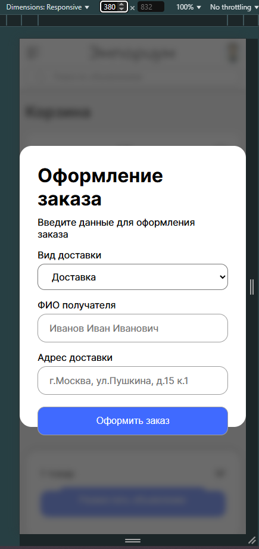

##### Визуальные в других браузерах

###### FireFox

- [x] **Новых ошибок визуала нет**
  - **Фактический результат:** Новые ошибки не появилось (в сравнении с Google Chrome)

    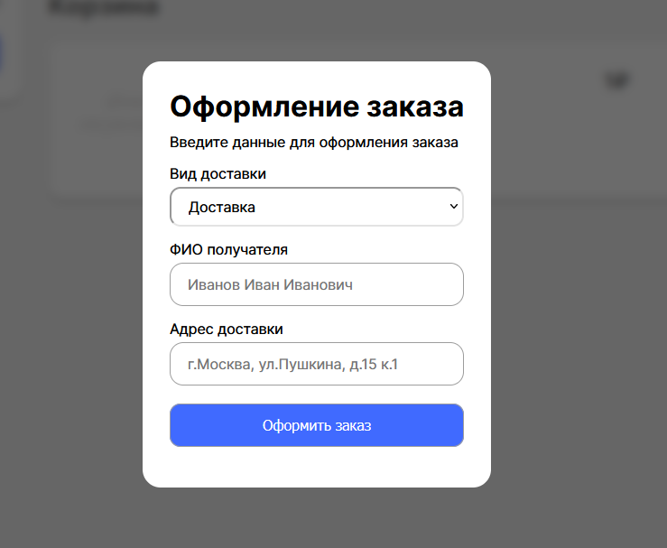
    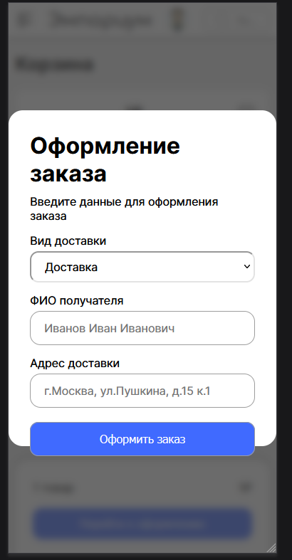

###### Opera

- [x] **Новых ошибок визуала нет**
  - **Фактический результат:** Новые ошибки не появилось (в сравнении с Google Chrome)

    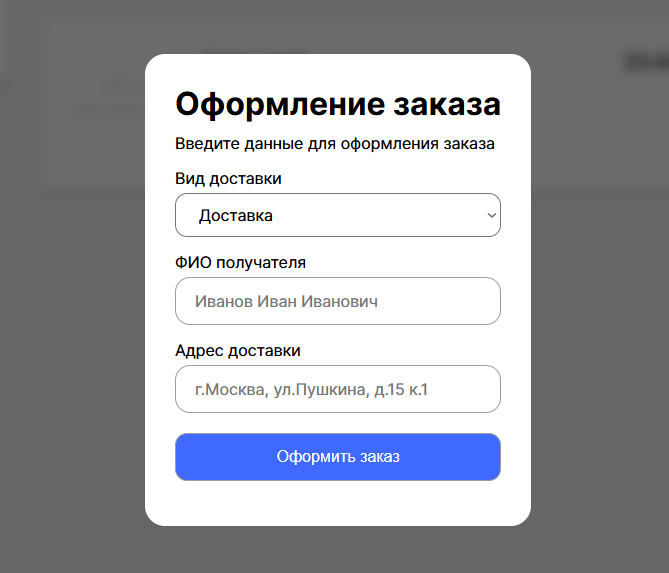
    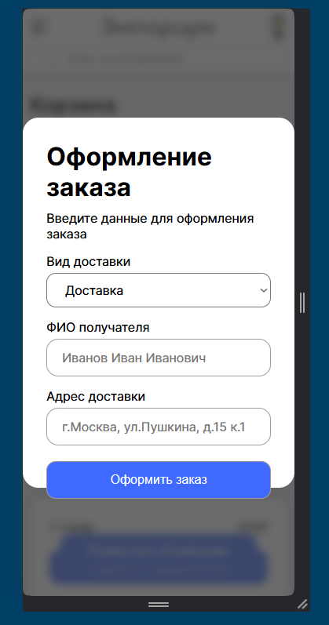

###### Edge

- [x] **Новых ошибок визуала нет**
  - **Фактический результат:** Новые ошибки не появилось (в сравнении с Google Chrome)

    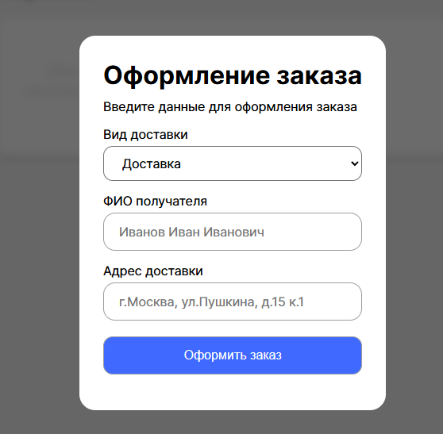
    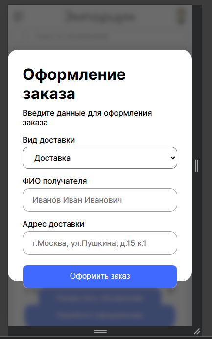

### 4.6 Заказы

##### Позитивные сценарии

---

##### Негативные сценарии

---

##### Визуальные

**$${\color{gold}БАГ.}$$**

- [ ] **Уменьшение ширины экрана до 280px** <a name="bug-4.6-001"></a>
  - **Фактический результат:** Выход номера телефона за границы блока

    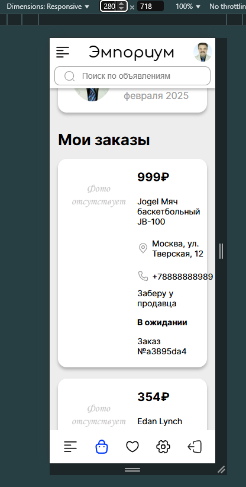

##### Визуальные в других браузерах

###### FireFox

- [x] **Новых ошибок визуала нет**
  - **Фактический результат:** Новые ошибки не появилось (в сравнении с Google Chrome)

    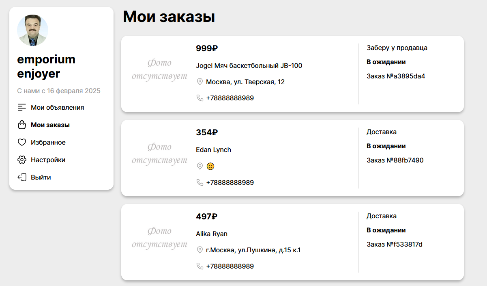
    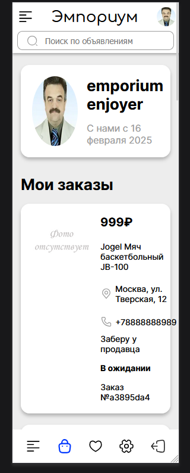

###### Opera

- [x] **Новых ошибок визуала нет**
  - **Фактический результат:** Новые ошибки не появилось (в сравнении с Google Chrome)

    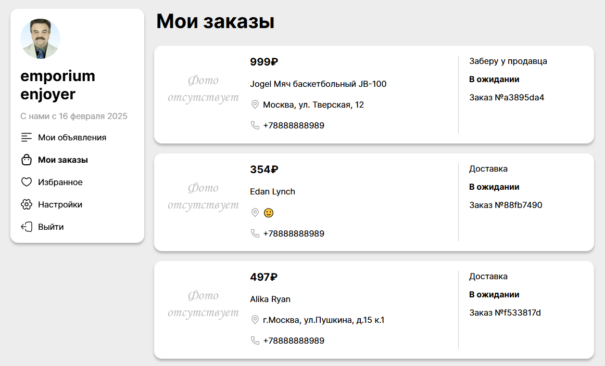
    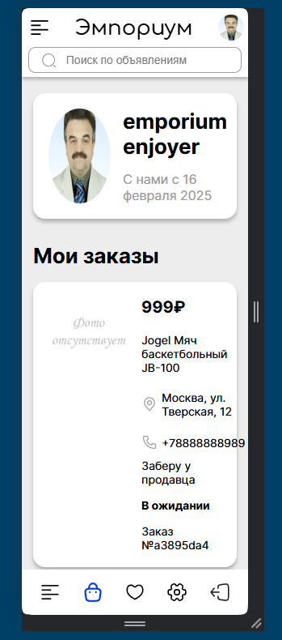

###### Edge

- [x] **Новых ошибок визуала нет**
  - **Фактический результат:** Новые ошибки не появилось (в сравнении с Google Chrome)

    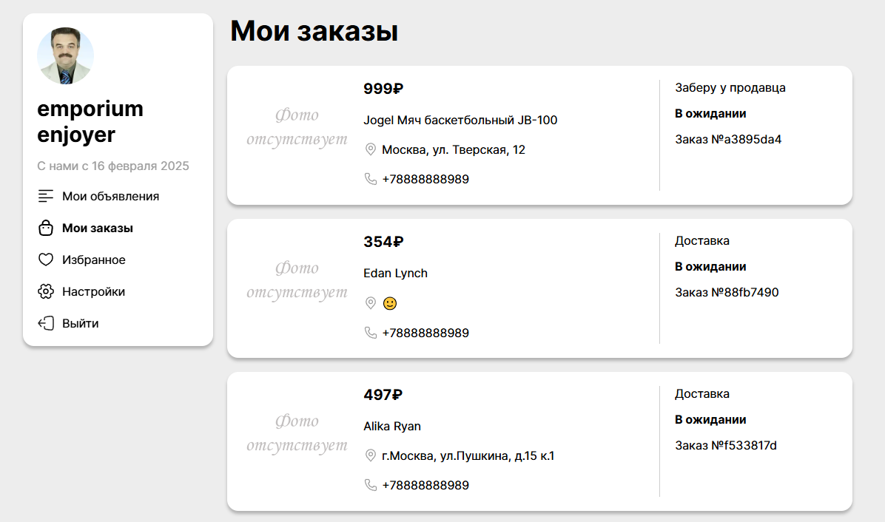
    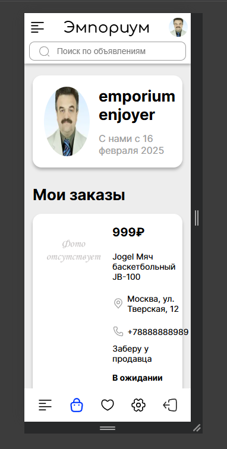

### 4.7 Каталог и главная страница

##### Позитивные сценарии

- [x] **Подгрузка новых объявлений при скролле главной страницы**
  - **Действие:** Скролл главной страницы
  - **Ожидание:** Подгрузка новых объявлений
  - **Фактический результат:** Подгрузка новых объявлений

    
    

- [x] **Переход к товарам выбранной категории**
  - **Действие:** Нажатие на ссылку категории

    

  - **Ожидание:** Редирект на страницу категории
  - **Фактический результат:** Редирект на страницу категории

    

##### Негативные сценарии

- [x]  **Изменить в html значение href на несуществующее**
  - **Действие:** Нажатие на ссылку категории // Перед этим поменять значение href c `/category/d4d10f10-4f9a-4bd5-ab1e-d2fc3ed35748` на `/category/11`

    

  - **Ожидание:** Появится сообщение о том, что такой категории не существует
  - **Фактический результат:** Появилось сообщение о том, что такой категории не существует

    

##### Визуальные

---

##### Визуальные в других браузерах

###### FireFox

- [x] **Новых ошибок визуала нет**
  - **Фактический результат:** Новые ошибки не появилось (в сравнении с Google Chrome)

    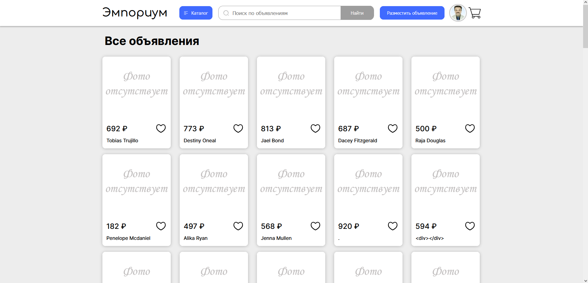
    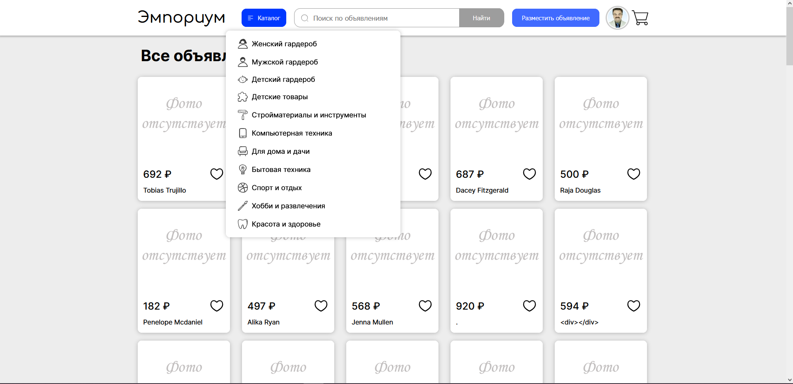

###### Opera

- [x] **Новых ошибок визуала нет**
  - **Фактический результат:** Новые ошибки не появилось (в сравнении с Google Chrome)

    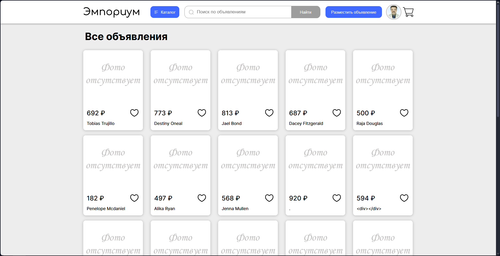
    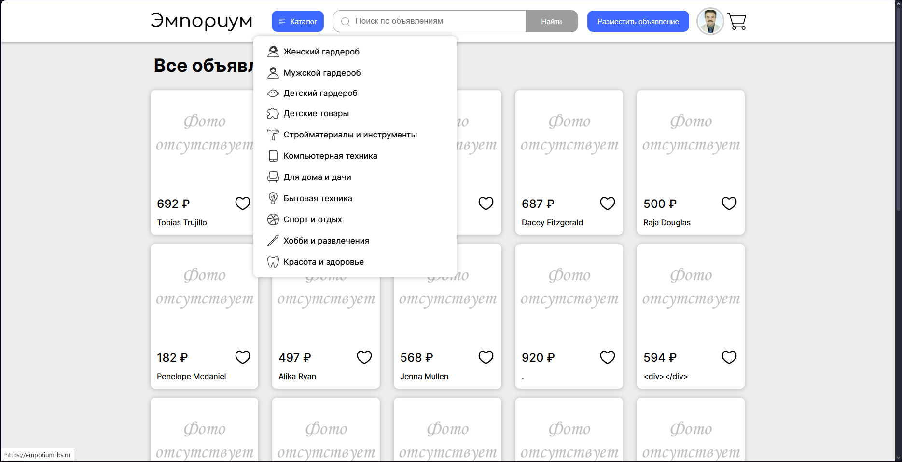

###### Edge

- [x] **Новых ошибок визуала нет**
  - **Фактический результат:** Новые ошибки не появилось (в сравнении с Google Chrome)

    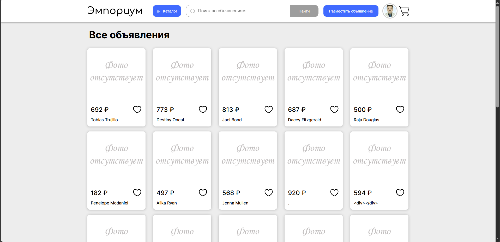
    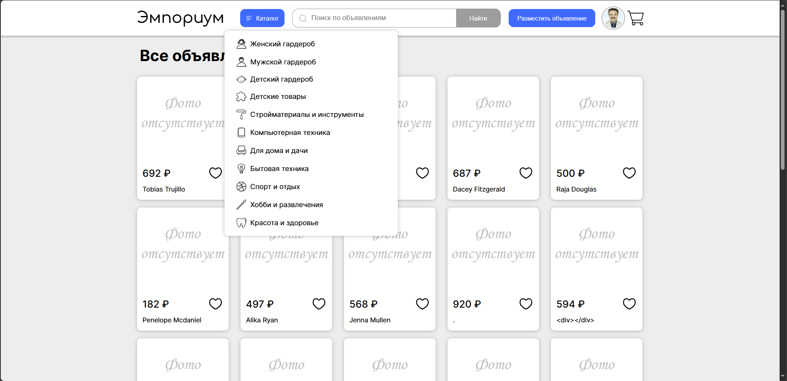

### 4.8 Страница товара (чужая)

##### Визуальные

###### Описание

**$${\color{gold}БАГ.}$$**

- [ ] **Уменьшение экрана до ширины 300px** <a name="bug-4.8-001"></a>
  - **Фактический результат:** Выход за границы экрана

  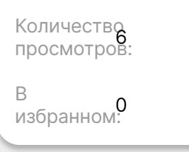

<br/><br/><br/>

### 4.9 Корзина

##### Позитивные сценарии

- [x] **Успешное добавление товара в корзину для авторизованного пользователя**
  - **Действие:** Нажатие на кнопку "В корзину"

    

  - **Ожидание:** Удалось успешно добавить товар в корзину
  - **Фактический результат:** Удалось успешно добавить товар в корзину

    
    

- [x] **Добавление товара в корзину для неавторизованного пользователя**
  - **Действие:** Нажатие на кнопку "В корзину"

    

  - **Ожидание:** Появление модального окна для авторизации
  - **Фактический результат:** Появление модального окна для авторизации

    

- [x] **Переход в корзину с главной страницы**
  - **Действие:** Нажатие на значок "корзина" в правом верхнем углу

    

  - **Ожидание:** Отображение страницы корзины. Так как корзина пустая - отображение пустой корзины и кнопки "За покупками"
  - **Фактический результат:** Отображение страницы корзины. Так как корзина пустая - отображение пустой корзины и кнопки "За покупками"

    

  - **Ожидание:** Отображение страницы корзины. Так как в корзине есть товары - отображение моей корзины
  - **Фактический результат:** Отображение страницы корзины. Так как в корзине есть товары - отображение моей корзины

    

- [x] **Переход со страницы корзины на главную**
  - **Действие:** Нажатие на кнопку "За покупками"

    

  - **Ожидание:** Отображение главной страницы с объявлениями
  - **Фактический результат:** Отображение главной страницы с объявлениями

    

- [x] **Оформление покупки для одного товара**
  - **Действие:** Нажатие на кнопку "Перейти к оформлению"

    

  - **Ожидание:** Появление модального окна для заполнения данных о доставке
  - **Фактический результат:** Появление модального окна для заполнения данных о доставке

    

  - **Действие:** Заполнение данных корректными данными

    

  - **Ожидание:** Переход на страницу заказы, где отображается заказ с присвоенным ему номером
  - **Фактический результат:** Переход на страницу заказы, где отображается заказ с присвоенным ему номером

    

- [x] **Выбор варианта получения с доставкой**
  - **Действие:** Выбор в выпадающем списке варианта "доставка"

    

  - **Ожидание:** Появление поля для ввода адреса
  - **Фактический результат:** Появление поля для ввода адреса

    

- [x] **Выбор варианта получения у продавца**
  - **Действие:** Выбор в выпадающем списке варианта "заберу у продавца"

    

  - **Ожидание:** Поля для ввода адреса нет
  - **Фактический результат:** Поля для ввода адреса нет

    

- [x] **Оформление покупки для нескольких товаров от разных продавцов**
  - **Действие:** Нажатие на кнопку "Перейти к оформлению"

    

  - **Ожидание:** Появление модального окна для заполнения данных о доставке
  - **Фактический результат:** Появление модального окна для заполнения данных о доставке

    

  - **Действие:** Заполнение данных корректными данными

    

  - **Ожидание:** Переход на страницу заказы, где отображается заказ с присвоенным ему номером. Так как товары принадлежат разным продавцам - для каждого товара каждого продавца создается отдельный заказ.
  - **Фактический результат:** Переход на страницу заказы, где отображается заказ с присвоенным ему номером. Так как товары принадлежат разным продавцам - для каждого товара каждого продавца создается отдельный заказ.

    

- [x] **Оформление покупки для нескольких товаров от одного продавца**
  **$${\color{red}БАГ.}$$** <a name="bug-4.9-001"></a>

  - **Действие:** Нажатие на кнопку "Перейти к оформлению"

    

  - **Ожидание:** Появление модального окна для заполнения данных о доставке
  - **Фактический результат:** Появление модального окна для заполнения данных о доставке

    

  - **Действие:** Заполнение данных корректными данными

    

  - **Ожидание:** Переход на страницу заказы, где отображается заказ с присвоенным ему номером. Так как товары принадлежат одному продавцу - создается общий заказ для этих двух товаров.
  - **Фактический результат:** Переход на страницу заказы, где отображается заказ с присвоенным ему номером. В заказ попал только один из товаров. Второй товар не учитывается.

    

##### Негативные сценарии

- [ ] **Попытка повторно добавить товар в корзину**
  - **Действие:** Нажатие на кнопку "В корзину"

    

  - **Ожидание:** После добавления товара в корзину текст кнопки меняется на "Товар уже в корзине", по кнопке осуществляется переход в корзину
  - **Фактический результат:** После добавления товара в корзину текст кнопки меняется на "Товар уже в корзине", по кнопке осуществляется переход в корзину

    
    

#### Визуальные

- [ ] **Уменьшение экрана до ширины 1000px** **$${\color{red}БАГ.}$$**  <a name="bug-4.9-001"></a>
  - **Фактический результат:** Пропадает кнопка "корзина"

  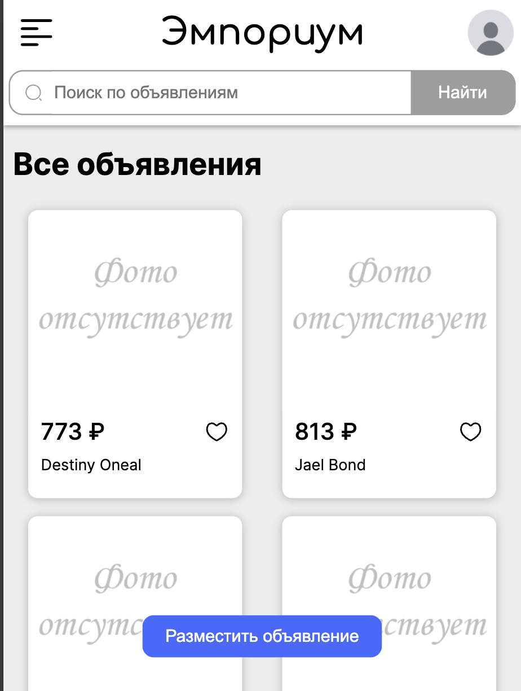


### 4.10 Избранное

##### Позитивные сценарии

- [x] **Успешное добавление товара в избранное с главной страницы**
  - **Действие:** Нажатие на кнопку со значком "сердце"

    

  - **Ожидание:** Кнопка добавления в избранное (иконка сердца) окрасилась в красный цвет, товар добавлен в избранное
  - **Фактический результат:** Кнопка добавления в избранное (иконка сердца) окрасилась в красный цвет, товар добавлен в избранное

    
    

- [x] **Успешное добавление товара в корзину со страницы товара**
  - **Действие:** Нажатие на кнопку со значком "сердце"

    

  - **Ожидание:** Кнопка добавления в избранное (иконка сердца) окрасилась в красный цвет, товар добавлен в избранное
  - **Фактический результат:** Кнопка добавления в избранное (иконка сердца) окрасилась в красный цвет, товар добавлен в избранное

    
    

- [x] **Обновление количества добавления товара в избранное**
  - **Действие:** Добавление товара в избранное с аккаунта "А"
  - **Действие:** Вход с аккаунта "Б"
  - **Действие:** Добавление товара в избранное с аккаунта "Б"

  - **Ожидание:** Счетчик избранного увеличился на 1. После добавления в избранное с аккаунта "Б" счетчик количества добавлений товара в избранное пользователями увеличился еще на один.
  - **Фактический результат:** Счетчик избранного увеличился на 1. После добавления в избранное с аккаунта "Б" счетчик количества добавлений товара в избранное пользователями увеличился еще на один.

    
    

#### Негативные сценарии

----

#### Визуальные

- [ ] **Уменьшение экрана до ширины 300px** **$${\color{red}БАГ.}$$**  <a name="bug-4.10-001"></a>
  - **Фактический результат:** Поломалась верстка - кнопка добавления в избранное (иконка сердца) не на одном уровне с ценой

  


---

## 5. Баги <a name="баги"></a>

| ID                                                     | Описание бага                                                                                                                                                                             | Шаги для воспроизведения                                                                                                                                                                                                              | Ожидаемый результат                                                                                    | Фактический результат                                                                                              | Приоритет [(Серьезность)]                  |
|--------------------------------------------------------|-------------------------------------------------------------------------------------------------------------------------------------------------------------------------------------------|---------------------------------------------------------------------------------------------------------------------------------------------------------------------------------------------------------------------------------------|--------------------------------------------------------------------------------------------------------|--------------------------------------------------------------------------------------------------------------------|--------------------------------------------|
| **Раздел 4.1: Размещение и редактирование объявлений** | **—**                                                                                                                                                                                     | **—**                                                                                                                                                                                                                                 | **—**                                                                                                  | **—**                                                                                                              | **—**                                      |
| 4.1-001                                                | Не отображается изображение после размещения/редактирования объявления                                                                                                                    | 1. Открыть размещение/редактирование объявления  <br/>2. Заполнить все поля, добавив изображение  <br/>3. Нажать на кнопку "Разместить объявление" или "Сохранить изменения"                                                          | Товар добавляется/обновляется с изображением                                                           | Картинка не отображается в странице товара и каталоге товаров                                                      | 🟠 $${\color{darkorange}Средний}$$ (Major) |
| 4.1-002                                                | Удалось создать товар с пустым названием и/или описанием и изменить их на пустые                                                                                                          | 1. Открыть размещение/редактирование объявления  <br/>2. Заполнить все поля, название и/или описание заполнить скриптом `<script>alert("Hello")</script>`  <br/>3. Нажать на кнопку "Разместить объявление" или "Сохранить изменения" | Создание/редактирование объявления с таким названием и/или описанием /на такое название и/или описание | Объявление разместилось с пустым названием и/или описанием / его поля изменились на пустое название и/или описание | 🟡 $${\color{gold}Низкий}$$ (Major)        |
| 4.1-003                                                | Поля ввода/выбора выходят за пределы видимого экрана при уменьшении размера экрана                                                                                                        | 1. Открыть размещение/редактирование объявления  <br/>2. Уменьшить экран до 300px                                                                                                                                                     | Поля ввода/выбора видно полностью                                                                      | Часть поля ввода/выбора и подписей к ним не видно                                                                  | 🟡 $${\color{gold}Низкий}$$ (Minor)        |
| 4.1-004                                                | Кнопка перехода на страницу создания объявления загораживает кнопку создания объявления/сохранения его изменений                                                                          | 1. Открыть размещение/редактирование объявления  <br/>2. Уменьшить экран до 300px                                                                                                                                                     | Кнопку создания объявления видно полностью                                                             | Другая кнопка загородила необходимую кнопку                                                                        | 🔴 $${\color{red}Высокий}$$ (Critical)     |
| 4.1-005                                                | При размере экрана меньше 1000px содержимое экрана не помещается и появляется горизонтальный ползунок                                                                                     | 1. Открыть размещение/редактирование объявления  <br/>2. Уменьшить экран до 1000px и меньше                                                                                                                                           | Все видно, ничто не выходит за пределы экрана                                                          | Не поместилось содержимое, появился горизонтальный ползунок                                                        | 🟡 $${\color{gold}Низкий}$$ (Minor)        |
| 4.1-006                                                | Открыть страницу создания/редактирования объявления в браузере Safari (нет окантовки поля выбора "Категория")                                                                             | 1. Открыть сайт в браузере Safari  <br/>2. Открыть размещение/редактирование объявления                                                                                                                                               | У поля выбора категории есть окантовка                                                                 | Окантовка отсутствует                                                                                              | 🟡 $${\color{gold}Низкий}$$ (Minor)        |
| **Раздел 4.3: Страница своего товара**                 | **—**                                                                                                                                                                                     | **—**                                                                                                                                                                                                                                 | **—**                                                                                                  | **—**                                                                                                              | **—**                                      |    
| [4.3-001](#bug-4.3-001)                                | Поломалась верстка описание объявления при уменьшении количества пикселей                                                                                                                 | Уменьшить экран до 300px                                                                                                                                                                                                              | Между оглавлением и левым краем есть небольшой отступ                                                  | Поломалась верстка                                                                                                 | 🟡 $${\color{gold}Низкий}$$                |
| [4.3-002](#bug-4.3-002)                                | Поломалась верстка оплаты при уменьшении количества пикселей                                                                                                                              | Уменьшить экран до 300px                                                                                                                                                                                                              | Блок покупки продвижения полностью помещается на экране                                                | Поломалась верстка                                                                                                 | 🟡 $${\color{gold}Низкий}$$                |
| **Раздел 4.4: Поиск**                                  | **—**                                                                                                                                                                                     | **—**                                                                                                                                                                                                                                 | **—**                                                                                                  | **—**                                                                                                              | **—**                                      |
| 4.4-001                                                | Поломалась верстка при возврате к предыдущему запросу                                                                                                                                     | 1. Ввести запрос `Настольная игр` <br/>2. Нажать на кнопку поиска <br/>3. Ввести запрос `Настольная игра` <br/>4. Нажать на кнопку поиска <br/>5. Нажать на кнопку вернуться                                                          | Видно предыдущий запрос                                                                                | Поломалась верстка                                                                                                 | 🟠 $${\color{darkorange}Средний}$$ (Major) |
| 4.4-002                                                | При уменьшении экрана визуально кнопка пропала, но навестись можно                                                                                                                        | 1. Уменьшить экран до 1200px                                                                                                                                                                                                          | Кнопка с иконкой поиска либо словом "Поиск", либо отсутствием кнопки вовсе                             | Кнопка есть, пустая                                                                                                | 🟡 $${\color{gold}Низкий}$$ (minor)        |
| 4.4-003                                                | При уменьшении экрана визуал не совпадает с тем, что в браузере Google Chrome (FireFox)                                                                                                   | 1. Уменьшить экран                                                                                                                                                                                                                    | Совпадает с визуалом в Google Chrome                                                                   | Не совпало                                                                                                         | 🟡 $${\color{gold}Низкий}$$ (minor)        |
| **Раздел 4.5: Оформление заказа**                      | **—**                                                                                                                                                                                     | **—**                                                                                                                                                                                                                                 | **—**                                                                                                  | **—**                                                                                                              | **—**                                      |
| [4.5-001](#bug-4.5-001)                                | Изменено значение value у вида доставки, это вызывает ошибку с бекенда, а не на уровне фронта                                                                                             | 1. Открыть оформление заказа </br> 2. Через код страницы поменять значение value и выбрать измененное значение </br> 3. Нажать на кнопку "Оформить заказ"                                                                             | Вывод соответствующей ошибки                                                                           | Ошибка пришла с бекенда                                                                                            | 🟡 $${\color{gold}Низкий}$$                |
| [4.5-002](#bug-4.5-002)                                | Введена длинная строка в поле "ФИО получателя", длина ввода никак не ограничена                                                                                                           | 1. Открыть оформление заказа </br> 2. Ввести 250 символов в поле "ФИО получателя" </br> 3. Нажать на кнопку "Оформить заказ"                                                                                                          | Ошибка "Длина ФИО не должна превышать N символов"                                                      | Вернулась ошибка с бэкенда                                                                                         | 🟡 $${\color{gold}Низкий}$$                |
| [4.5-003](#bug-4.5-003)                                | Введены битые символы, которые не запрещаются системой                                                                                                                                    | 1. Открыть оформление заказа </br> 2. Ввести битые символы в поле "ФИО получателя" </br> 3. Нажать на кнопку "Оформить заказ"                                                                                                         | Вывод соответствующей ошибки                                                                           | Заказ создался                                                                                                     | 🟡 $${\color{gold}Низкий}$$                |
| [4.5-004](#bug-4.5-004)                                | Введена длинная строка в поле "Адрес", длина ввода никак не ограничена                                                                                                                    | 1. Открыть оформление заказа </br> 2. Ввести 250 символов в поле "Адрес" </br> 3. Нажать на кнопку "Оформить заказ"                                                                                                                   | Ошибка "Длина адреса не должна превышать N символов"                                                   | Вернулась ошибка с бэкенда                                                                                         | 🟡 $${\color{gold}Низкий}$$                |
| [4.5-005](#bug-4.5-005)                                | Введены битые символы, которые не запрещаются системой, ошибки со стороны бекенда, возможная высокая уязвимость, проходит далеко                                                          | 1. Открыть оформление заказа </br> 2. Ввести битые символы в поле "Адрес" </br> 3. Нажать на кнопку "Оформить заказ"                                                                                                                  | Вывод соответствующей ошибки                                                                           | Вернулась ошибка с бэкенда                                                                                         | 🔴 $${\color{red}Высокий}$$                |
| [4.5-006](#bug-4.5-006)                                | Введено эмодзи в адресе доставки и они системой никак не запрещены, показывает, что нет проверки адреса на действительность                                                               | 1. Открыть оформление заказа </br> 2. Ввести `😀` в поле "Адрес" </br> 3. Нажать на кнопку "Оформить заказ"                                                                                                                           | Вывод соответствующей ошибки                                                                           | Заказ создался                                                                                                     | 🔴 $${\color{red}Высокий}$$                |
| [4.5-007](#bug-4.5-007)                                | Выход кнопки за границы блока при ширине экрана, меньшей 380px                                                                                                                            | 1. Открыть оформление заказа </br> 2. Уменьшить широту экрана до 380px                                                                                                                                                                | Кнопка не выходит за границы блока                                                                     | Кнопка выходит за границы блока                                                                                    | 🟡 $${\color{gold}Низкий}$$                |
| **Раздел 4.6: Заказы**                                 | **—**                                                                                                                                                                                     | **—**                                                                                                                                                                                                                                 | **—**                                                                                                  | **—**                                                                                                              | **—**                                      |
| [4.6-001](#bug-4.6-001)                                | Выход номера телефона за границы блока при ширине экрана, меньшей 280px                                                                                                                   | 1. Открыть страницу заказов </br> 2. Уменьшить широту экрана до 280px                                                                                                                                                                 | Номер телефона не выходит за границы блока                                                             | Номер телефона выходит за границы блока                                                                            | 🟡 $${\color{gold}Низкий}$$                |
| **Раздел 4.7: Каталог и главная страница**             | **—**                                                                                                                                                                                     | **—**                                                                                                                                                                                                                                 | **—**                                                                                                  | **—**                                                                                                              | **—**                                      |
| **Раздел 4.8: Страница товара (чужая)**                | **—**                                                                                                                                                                                     | **—**                                                                                                                                                                                                                                 | **—**                                                                                                  | **—**                                                                                                              | **—**                                      |
| [4.8-001](#bug-4.8-001)                                | Поломалась верстка при уменьшении количества пикселей                                                                                                                                     | Уменьшить экран до 300px                                                                                                                                                                                                              | Между оглавлением и левым краем есть небольшой отступ                                                  | Поломалась верстка                                                                                                 | 🟡 $${\color{gold}Низкий}$$                |
| **Раздел 4.9: Корзина**                                | **—**                                                                                                                                                                                     | **—**                                                                                                                                                                                                                                 | **—**                                                                                                  | **—**                                                                                                              | **—**                                      |
| [4.9-001](#bug-4.9-001)                                | Пропала кнопка "корзина" при уменьшении экрана до 1000 px                                                                                                                                 | 1. Уменьшить экран                                                                                                                                                                                                                    | Кнопка корзина не пропала                                                                              | Кнопка корзина пропала                                                                                             | 🟠 $${\color{darkorange}Средний}$$         |
| **Раздел 4.10: Избранное**                             | **—**                                                                                                                                                                                     | **—**                                                                                                                                                                                                                                 | **—**                                                                                                  | **—**                                                                                                              | **—**                                      |
| [4.10-001](#bug-4.10-001)                              | Поломалась верстка при уменьшении экрана до 300px                                                                                                                                         | 1. Уменьшить экран                                                                                                                                                                                                                    | Кнопка добавления в избранное и цена на одном уровне                                                   | Кнопка добавления в избранное (иконка сердца) и цена на разных уровнях                                             | 🟡 $${\color{gold}Низкий}$$                |

---

## 6. Выводы <a name="выводы"></a>
- Основные функциональности протестированы
- Обнаружены 60 багов, которые необходимо исправить

**Дата составления отчета:** 12.03.2025